# Dependency Graph

Solid arrows show production Go package imports or direct construction/wiring.
Dotted arrows show packages that directly read or write the SQLite runtime state
through `*sql.DB`.

```mermaid
flowchart TB

%% =========================
%% Layer 0
%% =========================
subgraph L0["Layer 0 - Entry"]
    CMD["cmd/server"]
end

%% =========================
%% Layer 1
%% =========================
subgraph L1["Layer 1 - App Composition"]
    APP["internal/app"]
end

%% =========================
%% Layer 2
%% =========================
subgraph L2["Layer 2 - HTTP / Business Modules"]
    ADMIN["internal/admin"]
    CLASSROOM["internal/classroom"]
    LESSON["internal/lesson"]
    QUESTION["internal/question"]
    PROGRESS["internal/progress"]
    SEED["internal/seed"]
    SUBMISSION["internal/submission"]
end

%% =========================
%% Layer 3
%% =========================
subgraph L3["Layer 3 - Async Judge"]
    SCHEDULER["internal/scheduler"]
    JUDGE["internal/judge"]
end

%% =========================
%% Layer 4
%% =========================
subgraph L4["Layer 4 - Platform"]
    AUTH["internal/platform/auth"]
    CLOCK["internal/platform/clock"]
    CONFIG["internal/platform/config"]
    DBPKG["internal/platform/db"]
    ERRS["internal/platform/errs"]
    HTTPX["internal/platform/httpx"]
    IDS["internal/platform/ids"]
    LOGGER["internal/platform/logger"]
    MIDDLEWARE["internal/platform/middleware"]
    PASSWORD["internal/platform/password"]
    SESSION["internal/platform/session"]
    USER["internal/platform/user"]
end

%% =========================
%% Layer 5
%% =========================
subgraph L5["Layer 5 - Runtime State"]
    DATA[("oj-lite.db")]
end

%% =========================
%% Entry / composition
%% =========================
CMD --> APP
CMD --> SCHEDULER

APP --> ADMIN
APP --> AUTH
APP --> CLASSROOM
APP --> LESSON
APP --> QUESTION
APP --> PROGRESS
APP --> SEED
APP --> SUBMISSION
APP --> USER
APP --> CONFIG
APP --> DBPKG
APP --> HTTPX
APP --> LOGGER
APP --> MIDDLEWARE
APP --> SESSION

%% =========================
%% Business and API auth packages
%% =========================
ADMIN --> USER
ADMIN --> ERRS
ADMIN --> HTTPX
ADMIN --> LOGGER
ADMIN --> PASSWORD

AUTH --> USER
AUTH --> ERRS
AUTH --> HTTPX
AUTH --> LOGGER
AUTH --> PASSWORD
AUTH --> SESSION

CLASSROOM --> AUTH
CLASSROOM --> ERRS
CLASSROOM --> HTTPX
CLASSROOM --> LOGGER
CLASSROOM --> PASSWORD

LESSON --> AUTH
LESSON --> ERRS
LESSON --> HTTPX
LESSON --> LOGGER

QUESTION --> AUTH
QUESTION --> ERRS
QUESTION --> HTTPX
QUESTION --> LOGGER

PROGRESS --> AUTH
PROGRESS --> ERRS
PROGRESS --> HTTPX
PROGRESS --> LOGGER

SUBMISSION --> AUTH
SUBMISSION --> ERRS
SUBMISSION --> HTTPX
SUBMISSION --> LOGGER

SEED --> PASSWORD
SEED --> USER

USER --> LOGGER

%% =========================
%% Async judge pipeline
%% =========================
SCHEDULER --> CONFIG
SCHEDULER --> JUDGE
SCHEDULER --> LOGGER

JUDGE --> LOGGER

%% =========================
%% Platform internals
%% =========================
DBPKG --> CONFIG

MIDDLEWARE --> AUTH
MIDDLEWARE --> HTTPX
MIDDLEWARE --> LOGGER
MIDDLEWARE --> SESSION

%% =========================
%% Runtime database access
%% =========================
ADMIN -.-> DATA
CLASSROOM -.-> DATA
LESSON -.-> DATA
QUESTION -.-> DATA
PROGRESS -.-> DATA
SEED -.-> DATA
SUBMISSION -.-> DATA
USER -.-> DATA
SCHEDULER -.-> DATA
DBPKG -.-> DATA
```



## Automated Check

The production Go package import arrows in this document are enforced by
`arch-go.yml` at the repository root.

Run the dependency check from the module root:

```sh
go install -v github.com/arch-go/arch-go/v2@v2.1.2
arch-go --color no
```

For a readable summary of the configured rules:

```sh
arch-go --color no describe
```

CI runs the same check on pull requests and pushes to `main`.

Notes:

- `arch-go` enforces package imports, not database runtime behavior.
- The dotted SQLite arrows remain architectural documentation for packages that
  directly read or write `oj-lite.db` through `*sql.DB`.
- `internal/platform/clock` and `internal/platform/ids` are platform leaf
  packages. They have no current production imports but are included in
  `arch-go.yml` so dependency-rule coverage stays at 100%.
