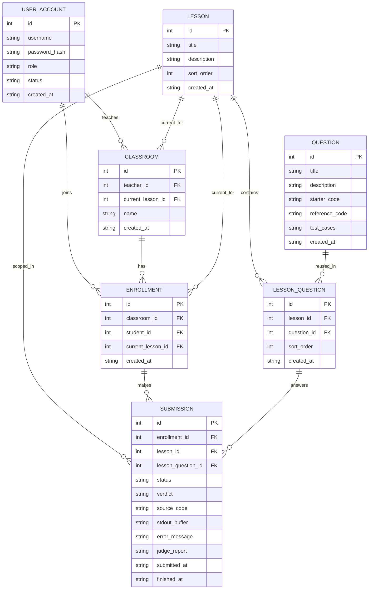

# ER

Additional notes:

- `USER_ACCOUNT` stores both `teacher` and `student` users. The local `admin` is not stored in the business user table.
- `user_account.username` is globally unique, has length `3..32`, and only allows `A-Za-z0-9_`.
- `classroom` uses the global lesson order. The current lesson is defined by `classroom.current_lesson_id`.
- The current implementation uses a unique index on `enrollment(student_id)`, so each student belongs to only one classroom.
- `ENROLLMENT.current_lesson_id` is kept in sync with `classroom.current_lesson_id` and is retained as part of submission ownership.
- `QUESTION.description` is stored and returned as JSON-object text. Older text descriptions are wrapped into an object by DTO conversion.
- `QUESTION.test_cases` is stored as JSON text and parsed by the judge runner.
- `LESSON_QUESTION` maintains the lesson-question relationship and order within a lesson.
- `SUBMISSION` stores three ownership links: `enrollment_id`, `lesson_id`, and `lesson_question_id`.
- `SUBMISSION.status` currently flows through `pending -> judging -> finished`.
- `SUBMISSION.verdict` currently allows `accepted`, `wrong_answer`, `runtime_error`, and `system_error`.
- `stdout_buffer` stores a JSON stdout report and is only populated when student code writes stdout.
- `error_message` stores a structured error summary.
- `judge_report` stores the JSON report generated by the judge.
- Judge-result fields are only fully populated after a submission finishes.
- After a question has any submission, trigger rules freeze its core judging fields.
- After a submission is inserted, trigger rules freeze its ownership fields and `source_code`.
